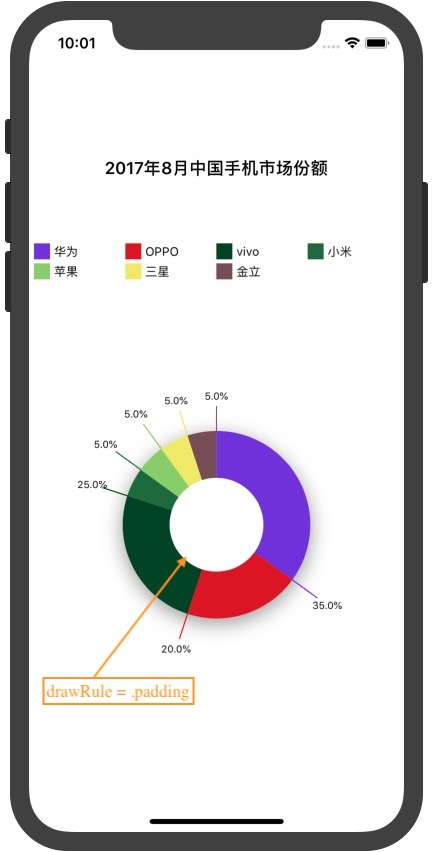
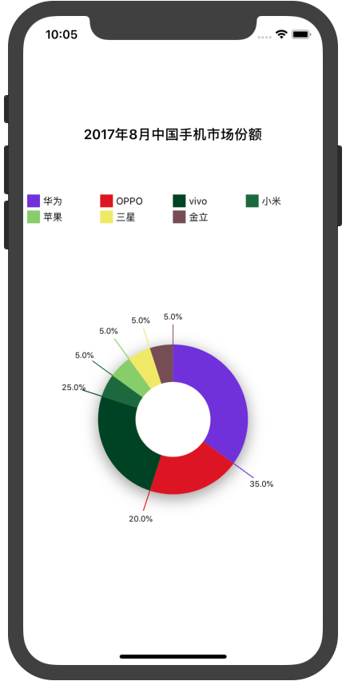
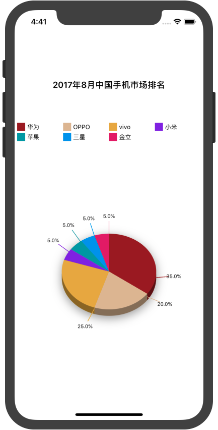

## 导入框架
 
* **使用 `Carthage`**

进入你的工程目录, 创建一个名为`Cartfile`的文件, 将下面的内容复制进去:

```
github "yutingLei/EasyRadian" "master"
```

然后在终端，`cd`到你的工程目录，运行下面的命令: 

```
$ carthage update
```

## 使用

### **初始化`ERView`**

初始化`ERView`, 需要构建`drawsInfo`，代码如下.

```swift
let frame = CGRect(x: 0, y: 64, width: view.frame.width, height: view.frame.height - 128)
let drawsInfo = [["type": "华为", "percent": "35%"],
                 ["type": "OPPO", "percent": "20%"],
                 ["type": "vivo", "percent": "25%"],
                 ["type": "小米", "percent": "5%"],
                 ["type": "苹果", "percent": "5%"],
                 ["type": "三星", "percent": "5%"],
                 ["type": "金立", "percent": "5%"]]
let erView = ERView(frame: frame, drawsInfo: drawsInfo)
```

当然也可以不构建`drawsInfo`，后面用给参数赋值的方式也可以.

```swift
let frame = CGRect(x: 0, y: 64, width: view.frame.width, height: view.frame.height - 128)
let erView = ERView(frame: frame)
erView?.drawsInfo = <#绘制信息#>
```

然后将你创建的`erView`添加到你的视图上，注意初始化函数可能返回`nil`，是因为你创建的视图太小.

```swift
if let erView = erView {
	view.addSubview(erView)
}
```

此时`erView`中没有任何东西, 你还需要设置一些参数.

### **Config**

| property | type | description |
| :----------: | :----: | :---------: |
| `drawRule` | enum | `padding`, `fill`, 两种图形. |
| `showShadow` | bool | 在绘制百分比图时，是否显示阴影效果. 默认 `true` |
| `showPercentInRadian` | bool | 显示百分比, 默认 `true` |
| `titleText` | string | 视图的标题. `optional` |
| `titleLabel` | UILabel | 视图标题创建成功后的标签实例, 只读 |
| `showDigest` | bool | 是否显示摘要，若显示，则必须设置`digestLoc` |
| `digestKey`  | string | 获取摘要值得key |
| `digestLoc` | enum | 摘要显示位置 |
| `percentKey` | string | 获取百分值得key |
| `drawsInfo` | array.of(object/number)| 绘制的信息 |
| `colors` | array.of(UIColor)|每个百分值所对应的颜色. `optional` |
| `show3DEffect` | bool | 3D效果，`true`下，`drawRule`设置无用 |

配置说明:  
	- 如果未设置颜色`colors`，将会生成随机颜色。
	- 任何参数都必须在调用`startDraw()`函数之前设置好

例如:

```
// erView.drawRule = .fill // default is fill, so you needn't set it.
erView.drawRule = .padding
erView.titleText = "2017年8月中国手机市场份额"
erView.digestLoc = .top
erView.digestKey = "type"
erView.percentKey = "percent"
erView.showShadow = false
```

### **绘制**

调用`startDraw()`开始绘制.

```
erView.startDraw()
```

### **效果图**

`showShadow`: `true` 或 `false`

<div align="center">


</div>

`drawRule`: `.padding`, `.fill`

<div align="center">


</div>

`digestLoc`: `top` `left` `right` `bottom`

<div align="center">



</div>

`show3DEffect`(将不会使用`drawRule`设置)

<div align="center">

</div>