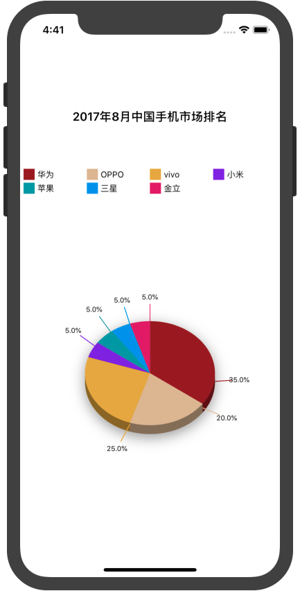

## Install
 
* **Use `Carthage`**

`cd` to your project, and create a file named `Cartfile`, and fill follow contents:

```
github "yutingLei/EasyRadian" "master"
```

then: 

```
$ carthage update
```

## Usage

### **Init `ERView`**

Init with `ERView`, and constructure `DrawsInfo`.

```swift
let frame = CGRect(x: 0, y: 64, width: view.frame.width, height: view.frame.height - 128)
let drawsInfo = [["type": "华为", "percent": "35%"],
                 ["type": "OPPO", "percent": "20%"],
                 ["type": "vivo", "percent": "25%"],
                 ["type": "小米", "percent": "5%"],
                 ["type": "苹果", "percent": "5%"],
                 ["type": "三星", "percent": "5%"],
                 ["type": "金立", "percent": "5%"]]
let erView = ERView(frame: frame, drawsInfo: drawsInfo)
```
and then, add `erView` to the contentView that you want to show in.

```swift
if let erView = erView {
	view.addSubview(erView)
}
```

there is nothing at present, you should config some properties.

### **Config**

| property | type | description |
| :----------: | :----: | :---------: |
| `drawRule` | enum | `padding`, `fill`, see below. |
| `showShadow` | bool | Graphic radian view with shadow. default `true` |
| `showPercentInRadian` | bool | Show the percent string in the `erView`, default `true` |
| `titleText` | string | The view's title. `optional` |
| `titleLabel` | UILabel | The view's title label, get only |
| `showDigest` | bool | Show the digest |
| `digestKey`  | string | The key that get the digest's value |
| `digestLoc` | enum | Where the digest should to graphic |
| `percentKey` | string | The key that get the percent's value |
| `drawsInfo` | array.of(object/number)| The infos that will be graphic |
| `colors` | array.of(UIColor)| Every radian's color. `optional` |
| `show3DEffect` | bool | 3D effect |

<mark>if you set `colors` with `nil`. graphic with random color.</mark>

for example:

```
// erView.drawRule = .fill // default is fill, so you can't set it.
erView.drawRule = .padding
erView.titleText = "2017年8月中国手机市场份额"
erView.digestLoc = .top
erView.digestKey = "type"
erView.percentKey = "percent"
erView.showShadow = false
```

### **Graphics**

you must invoke `startDraw()` method.

```
erView.startDraw()
```

### **Effects**

`showShadow`: `true` or `false`

<div align="center">


</div>

`drawRule`: `.padding`, `.fill`

<div align="center">


</div>

`digestLoc`: `top` `left` `right` `bottom`

<div align="center">


</div>

`show3DEffect`(ignore `drawRule`)

<div align="center">

</div>