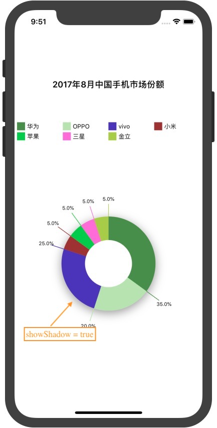
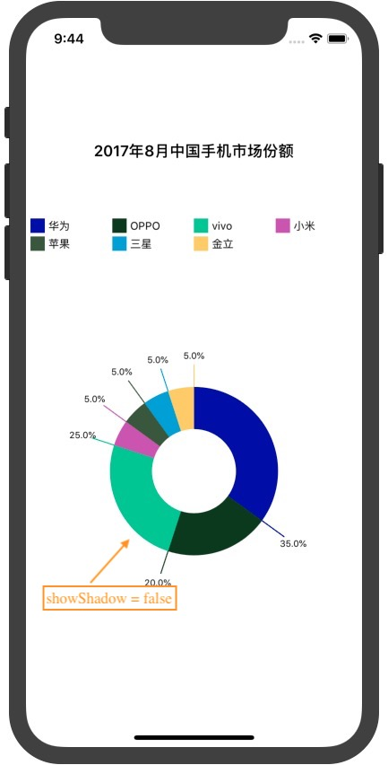
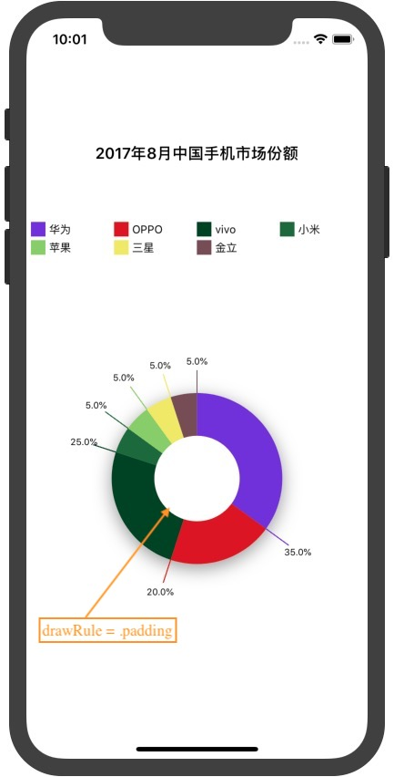
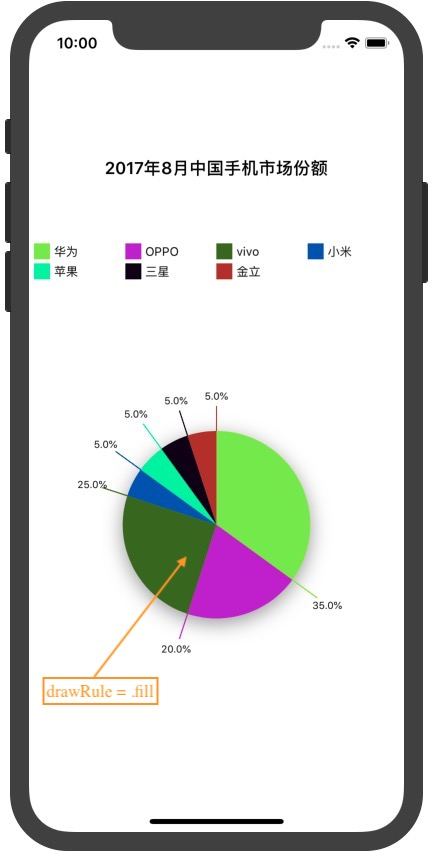
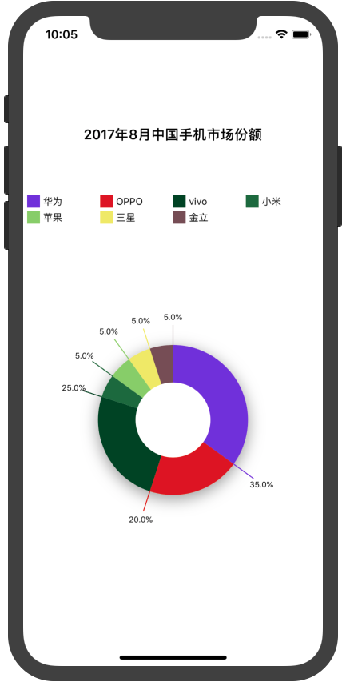
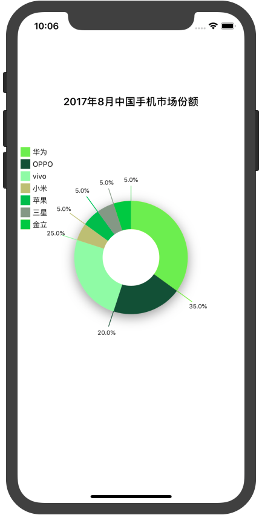
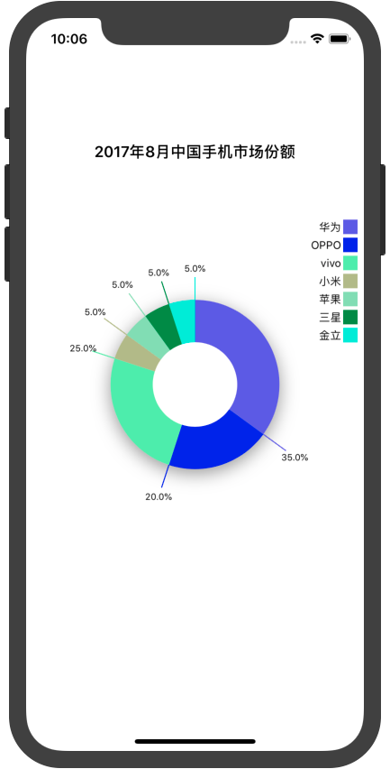
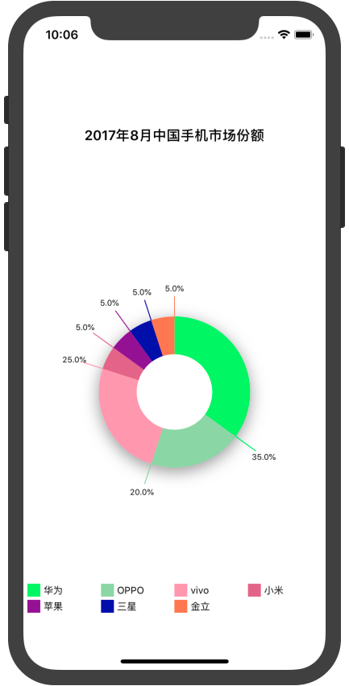

## Install
 
* **Use `Cathage`**

`cd` to your project, and create a file named `Cartfile`, and fill content with follow:

```
github "yutingLei/EasyRadian" "master"
```

then: 

```
$ carthage update
```

## Usage

### **Init `ERView`**

Init with `ERView`, and constructure `DrawsInfo`.

```
let frame = CGRect(x: 0, y: 64, width: view.frame.width, height: view.frame.height - 128)
let drawsInfo = [["type": "华为", "percent": "35%"],
                 ["type": "OPPO", "percent": "20%"],
                 ["type": "vivo", "percent": "25%"],
                 ["type": "小米", "percent": "5%"],
                 ["type": "苹果", "percent": "5%"],
                 ["type": "三星", "percent": "5%"],
                 ["type": "金立", "percent": "5%"]]
let erView = ERView(frame: frame, drawsInfo: drawsInfo)
```
and then, add `erView` to the contentView that you want to show on. also, there is nothing at the time, you should config some params.

### **Config**

| param's name | description |
| :----------: | :---------: |
| `drawRule` | `padding`, `fill`, see below. |
| `showShadow` | The radian View has shadow. default `true` |
| `showPercentInRadian` | Show the percent string in the `erView`, default `true` |
| `titleText` | The view's title. `optional` |
| `titleLabel` | The view's title label, get only |
| `showDigest` | Show the digest |
| `digestKey`  | The key that get the digest's value |
| `digestLoc` | Where the digest graphics |
| `percentKey` | The key that get the percent's value |
| `drawsInfo` | The info that will graphics |
| `colors` | Every radian's color. `optional` |

<mark>if you set `colors` with `nil`. stroke with random color.</mark>

for example:

```
// erView.drawRule = .fill // default is fill, so you can't set it.
erView.drawRule = .padding
erView.titleText = "2017年8月中国手机市场份额"
erView.digestLoc = .top
erView.digestKey = "type"
erView.percentKey = "percent"
erView.showShadow = false
```

### **Stroke**

you must invoke `startDraw()` method.

```
erView.startDraw()
```

### **Results**

`showShadow`: `true` or `false`

<di align="center">


</di>

`drawRule`: `.padding`, `.fill`

<di align="center">


</di>

`digestLoc`: `top` `left` `right` `bottom`

<di align="center">




</di>